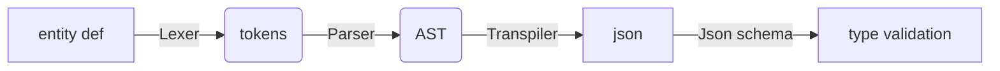

# Entity Def Compiler

## Motivation

Imagine an entity definition like this sprite definition

```txt
entitydef "modmans_mod_mold_sprite"
{
  texturename monster_sprites
  xloc 0
  yloc 0
  width 80
  height 128
}
```

If we can convert these into JSON (or YAML) format and back into entitydefs, we could leverage the whole set of tools that are availabe for JSON, for example

- [jsonschema](https://cswr.github.io/JsonSchema/) for validation and typing
- cross-checking existence of related files like `monster_sprites.png`
- cross-checking existence of related entity defs (useful in monster definitions, which referene sprites, powers, tables and more)

Even without the conversion into JSON, having an Abstract Syntax Tree would allow for syntax validation, linting, and more. Each tool hopefully making the dev experience slightly nicer, thereby allowing to focus on the mod contents instead.

There are further proven libs to convert between json and yaml, and since yaml is so easy to write for a human, we could instead write yaml, then have it converted to json, and from there back down to entity defs.

### Idea

Conversion chain



And vice versa for the inverse tool chain.

Note: One thing missing for the final step type validation is knowing what kind of entity def this is. This info may potentially be derived from the `class` or by structure (similar to typescript's type inference).

### Isn't This Overkill?

Yes! I am totally aware it is overkill. But it's also fun and a great learning project. 😎

## Building

```sh
# Build
nx build entity-def-compiler

# Test
nx test entity-def-compiler
```

## Entity Def Language Specification

Following this [nomenclature](https://craftinginterpreters.com/representing-code.html) (which is close to the [Backus-Naur form](https://en.wikipedia.org/wiki/Backus%E2%80%93Naur_form)) and using the TokenTypes defined in the lexer within this project.

```txt
Expression -> ENTITYDEF STRING EOL LEFT_BRACE EOL statement* RIGHT_BRACE EOL
#
Statement -> STRING (STRING | NUMBER | TRUE | FALSE)
```

where the `*` in `statements*` means there can be zero to however many statements.
